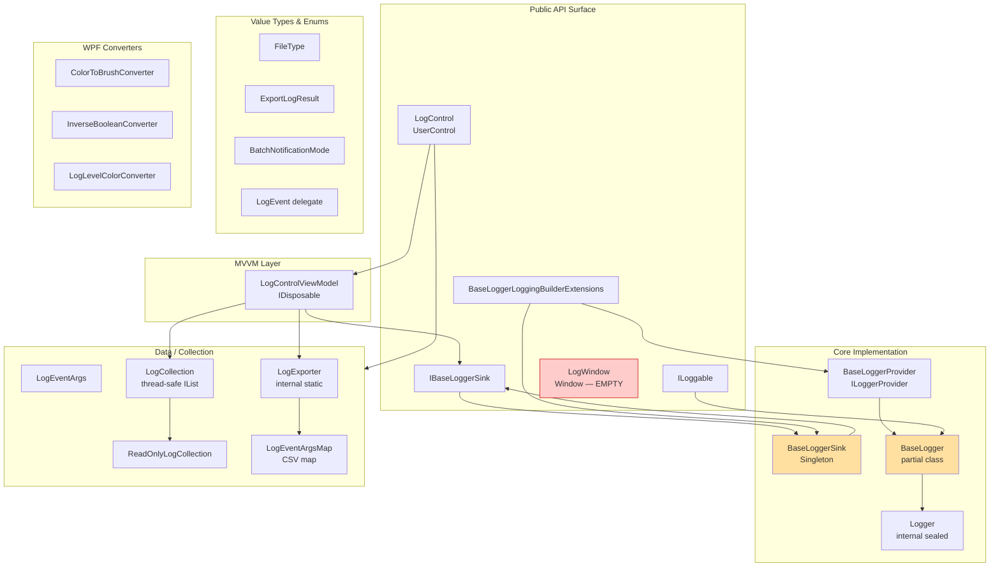
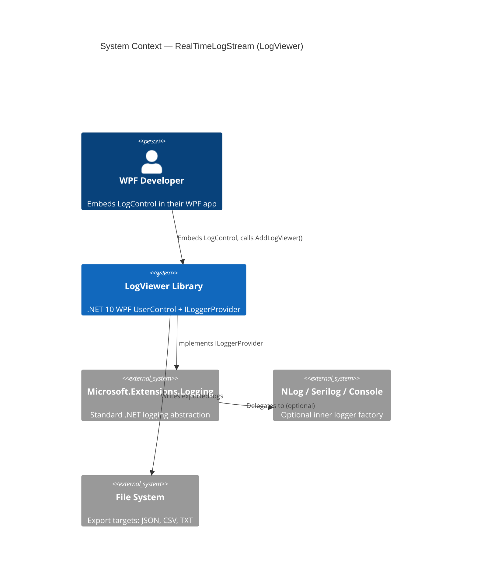
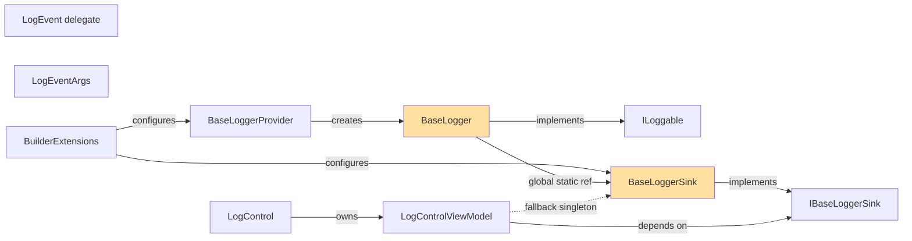
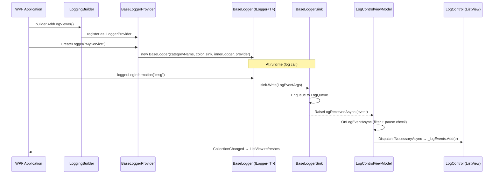
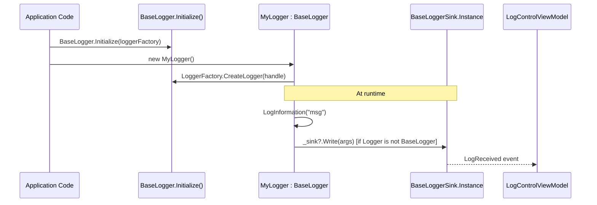
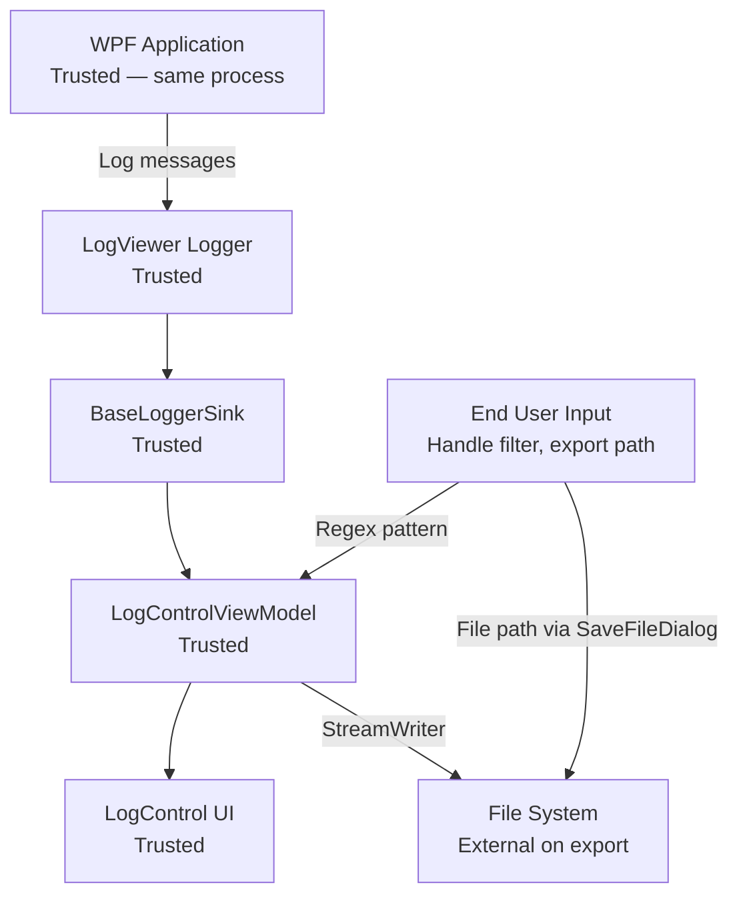

# Architecture Review Report — LogViewer (RealTimeLogStream)

**Generated**: 2026-05-16 12:00:00  
**Scope**: Full Review — Readiness for Embedded WPF Log Viewer in .NET 8 Application  
**Reviewer**: Claude Code (claude-sonnet-4-6)  
**Repository**: LogViewer / RealTimeLogStream v0.3.1.0  
**Package ID**: `RealTimeLogStream`

---

## Executive Summary

### Overall Architecture Health Score: 67/100 (Grade: D)

| Dimension | Score | Status | Priority |
|-----------|-------|--------|----------|
| System Structure | 15/20 | 🟡 Fair | Medium |
| Design Patterns | 14/20 | 🟡 Fair | Medium |
| Dependency Architecture | 10/15 | 🟡 Fair | High |
| Data Flow & State Management | 11/15 | 🟡 Fair | Medium |
| Scalability & Performance | 11/15 | 🟢 Good | Low |
| Security Architecture | 6/15 | 🔴 Needs Work | Critical |

> **Note on scoring**: The overall grade is pulled down primarily by a critical Target Framework Mismatch (the single biggest blocker for the stated .NET 8 readiness goal), a bug in `ExportLogResult`, and the global-static design coupling core infrastructure to a singleton. The underlying implementation quality of the individual components is genuinely high — thread safety, WPF performance optimisation, and documentation are above average for a library of this scope.

**Key Findings** (Top 5):

1. 🔴 **Critical — Target Framework Mismatch**: The project targets `net10.0-windows` but the README advertises `.NET 8.0 Windows` and the CI workflow installs the `.NET 8 SDK`. A consuming `.NET 8` WPF application **cannot reference this NuGet package**. The CI pipeline almost certainly fails to build the package correctly. This is the primary blocker for the stated goal.
2. 🔴 **Critical — `ExportLogResult.Success` is never set to `true`**: Every successful export still returns `Success = false`. Any caller that checks this field will always see failure.
3. 🟡 **High — Pervasive global static state on `BaseLogger`**: `LoggerFactory`, `Initialized`, `MaxLogQueueSize`, `ExcludeCharsFromHandle`, and others are process-wide statics. This prevents multiple concurrent instances, complicates unit testing (mitigated by the `GlobalStateCollection` workaround), and couples all consumers to a single configuration.
4. 🟡 **High — `ILoggable` and `BaseLogger` have WPF `Color` in the public contract**: `System.Windows.Media.Color` couples the core logging abstraction to WPF/Windows, blocking headless tests and any future non-WPF use.
5. 🟢 **Strength — Thread safety and performance optimisation are well implemented**: `ConditionalWeakTable<>` for deduplication, `ArrayPool<Task>` for multi-subscriber dispatch, `LazyThreadSafetyMode.ExecutionAndPublication` for provider caching, and WPF virtualisation settings are all appropriate production-quality choices.

**Recommended Focus Areas** (priority order):

1. 🔴 [HIGH] Add `net8.0-windows` as a target framework — Est. 0.5 days
2. 🔴 [HIGH] Fix `ExportLogResult.Success = true` after successful write — Est. 0.1 days
3. 🟡 [MEDIUM] Fix CI workflow `dotnet-version` to match the actual TFM — Est. 0.25 days
4. 🟡 [MEDIUM] Remove `System.Windows.Media.Color` from core interfaces — Est. 2 days
5. 🟡 [MEDIUM] Eliminate (or isolate) global static state on `BaseLogger` — Est. 3 days
6. 🟢 [LOW] Replace Newtonsoft.Json with System.Text.Json — Est. 1 day
7. 🟢 [LOW] Implement `LogWindow.xaml` content (currently an empty shell) — Est. 1 day

---

## 1. System Structure Assessment

### 1.1 Component Hierarchy



**Findings**:

- ✅ The separation between `IBaseLoggerSink` and `BaseLoggerSink` is clean — the VM depends on the interface, not the concrete singleton
- ✅ `ReadOnlyLogCollection` correctly wraps `LogCollection` to enforce the immutability contract at the VM boundary
- ⚠️ `LogWindow.xaml` is an empty shell (`<Grid></Grid>`) — it ships in the package but provides no functionality
- ⚠️ `BaseLogger` is a `partial class` split across `BaseLogger.cs` (instance methods) and `BaseLogger.Settings.cs` (static configuration). The split is logical but static settings mixed into an instance type adds conceptual overhead
- 🔴 `ILoggable` exposes `System.Windows.Media.Color` — a WPF type — in a logging abstraction interface. This couples all implementations to Windows/WPF

### 1.2 Module Boundaries

**Analyzed Modules**:
- Logging infrastructure (`BaseLogger`, `BaseLoggerProvider`, `BaseLoggerSink`)
- UI layer (`LogControl`, `LogWindow`, `LogControlViewModel`)
- Data/serialisation (`LogCollection`, `ReadOnlyLogCollection`, `LogExporter`, `LogEventArgsMap`)
- Extension/DI wiring (`BaseLoggerLoggingBuilderExtensions`)

**Boundary Violations / Concerns**:

```text
⚠️ LogViewer/ILoggable.cs:27
   → System.Windows.Media.Color in a core logging interface
   ✓ Fix: Replace Color with a platform-neutral type (e.g. string hex, or a 
     custom struct) and add a WPF-specific extension/adapter layer

⚠️ LogViewer/LogControlViewModel.cs:306
   → CreateLoggerIfNotDesignMode() uses BaseLoggerSink.Instance (singleton) 
     as a fallback, bypassing the injected _sink
   ✓ Fix: Rely solely on the injected sink; remove the singleton fallback path

⚠️ LogViewer/LogControl.xaml.cs:439
   → LogControl calls BaseLogger.LogExceptionActions[LogLevel.Critical] directly
     (static dictionary access), bypassing the ViewModel's logger
   ✓ Fix: Route all logging through the injected _viewModel.Logger

🔴 LogViewer/BaseLogger.Settings.cs:120
   → LoggerFactory is a public static mutable property on BaseLogger
     (public static ILoggerFactory? LoggerFactory { get; internal set; })
   → Any code can replace the factory at any time, mid-flight
   ✓ Fix: Make this internal and immutable after Initialize(); or eliminate 
     the inheritance pattern in favour of pure DI
```

### 1.3 Layered Design Compliance

| Layer | Compliance | Issues Found |
|-------|-----------|--------------|
| Core Abstractions (`IBaseLoggerSink`, `ILoggable`) | 85% ✅ | `Color` in interface |
| Implementation (`BaseLogger`, `BaseLoggerSink`) | 70% 🟡 | Global statics, singleton |
| UI Layer (`LogControl`, `LogControlViewModel`) | 80% ✅ | Dispatcher coupling, `CreateLoggerIfNotDesignMode` fallback |
| Integration (`BaseLoggerLoggingBuilderExtensions`) | 90% ✅ | Minor: applies global settings as a side effect |

### 1.4 C4 Context Diagram



---

## 2. Design Pattern Evaluation

### 2.1 Identified Patterns

| Pattern | Location | Implementation Quality | Notes |
|---------|----------|----------------------|-------|
| Singleton | `BaseLoggerSink.Instance` | 🟡 Partial | Correct lazy-init; however, global state makes testing hard. `CreateForTesting()` factory is a good mitigation |
| Observer | `LogEvent` delegate, `INotifyCollectionChanged` | ✅ Excellent | Async multi-subscriber dispatch with `ArrayPool<Task>` |
| Factory | `BaseLogger.CreateLogger()`, `BaseLoggerProvider.CreateLogger()` | ✅ Good | `Lazy<T>` + `LazyThreadSafetyMode.ExecutionAndPublication` prevents double-init under contention |
| MVVM | `LogControlViewModel` + `CommunityToolkit.Mvvm` + `PropertyChanged.Fody` | ✅ Good | Fody IL weaving reduces boilerplate; `[AddINotifyPropertyChangedInterface]` works correctly |
| Adapter | `BaseLoggerProvider` implements `ILoggerProvider` | ✅ Excellent | Enables plug-in to any `ILoggingBuilder` pipeline |
| Decorator | `BaseLoggerProvider` wrapping an inner `ILoggerFactory` | ✅ Good | Clean dual-sink architecture |
| Command | `AsyncRelayCommand`, `RelayCommand` from CommunityToolkit | ✅ Good | Appropriate for WPF MVVM |
| Template Method | `BaseLogger` as base class for `Logger` | 🟡 Partial | The inheritance pattern is provided for convenience but conflicts with the DI pattern |
| Read-Only Wrapper | `ReadOnlyLogCollection` over `LogCollection` | ✅ Excellent | Preserves WPF ListView virtualisation via `ReadOnlyCollection<T>` |

### 2.2 Pattern Consistency

**Inconsistencies Detected**:

1. **Dual initialisation patterns**: The library supports two fundamentally different integration paths:
   - **Inheritance**: Call `BaseLogger.Initialize(factory)`, then extend `BaseLogger`
   - **DI**: Call `builder.AddLogViewer()`, inject `ILogger<T>`

   These two paths share the same `BaseLoggerSink.Instance` singleton but configure it differently. The `BaseLogger.Settings.cs` hosts global statics that apply to both, which creates subtle ordering dependencies (e.g. `LogDateTimeFormat` is set in `AddLogViewerCore` as a side effect).

2. **`FileType` with Fody but no mutable properties**: `FileType` is decorated with `[AddINotifyPropertyChangedInterface]` but all its properties are getter-only (`{ get; }`). Fody will add the interface but generate no property-changed calls. The attribute is harmless but misleading.

### 2.3 Anti-Patterns Detected

🔴 **Global Static State as Configuration Store**:

```csharp
// ❌ ANTI-PATTERN: Mutable global statics on an instance type
// Location: LogViewer/BaseLogger.Settings.cs:120
public static ILoggerFactory? LoggerFactory { get; internal set; }
public static bool Initialized;
public static int MaxLogQueueSize { get; set; } = 10000;
public static bool LogUTCTime { get; set; }

// ✓ RECOMMENDED: Encapsulate per-instance or per-provider configuration
// Move shared settings into BaseLoggerProviderOptions (already exists for DI path)
// and pass an IOptions<BaseLoggerProviderOptions> into BaseLoggerSink
```

🔴 **`ExportLogResult.Success` never set to `true`**:

```csharp
// ❌ BUG — Location: LogViewer/LogControlViewModel.cs:668
public async Task<ExportLogResult> ExportLogsAsync(CancellationToken cancellationToken = default)
{
    var output = new ExportLogResult() { Success = false };
    try
    {
        // ... write file ...
        await writer.FlushAsync(cancellationToken);
        // ← output.Success = true; IS MISSING HERE
    }
    catch ...
    return output; // Always returns Success = false
}

// ✓ RECOMMENDED: Add the assignment after FlushAsync
await writer.FlushAsync(cancellationToken);
output.Success = true; // ← ADD THIS
```

⚠️ **Fire-and-Forget Async (Unobserved Exceptions)**:

```csharp
// ⚠️ ANTI-PATTERN — Location: LogViewer/BaseLogger.cs:478
protected void OnLogEvent(LogEventArgs eventArgs)
{
    _ = OnRaiseLogEventAsync(LogEvent, eventArgs); // ← unobserved task
}

// ⚠️ Also: LogViewer/BaseLoggerSink.cs:67
_ = RaiseLogReceivedAsync(logEvent); // ← unobserved task

// ✓ RECOMMENDED for fire-and-forget: catch inside the async method
// (already partially done via try/catch in RaiseLogReceivedAsync)
// but unhandled TaskScheduler.UnobservedTaskException is still possible
// in corner cases. Consider hooking TaskScheduler.UnobservedTaskException
// in app startup for diagnostics.
```

---

## 3. Dependency Architecture

### 3.1 Dependency Graph



### 3.2 Coupling Analysis

| Component | Afferent (Ca) | Efferent (Ce) | Instability I=Ce/(Ce+Ca) |
|-----------|--------------|--------------|--------------------------|
| `IBaseLoggerSink` | 4 | 0 | 0.00 (stable) |
| `LogEventArgs` | 7 | 1 | 0.13 (stable) |
| `BaseLogger` | 3 | 6 | 0.67 (volatile) |
| `BaseLoggerSink` | 5 | 2 | 0.29 (moderate) |
| `LogControlViewModel` | 1 | 7 | 0.88 (volatile) |
| `LogCollection` | 2 | 1 | 0.33 (moderate) |

### 3.3 Circular Dependencies

✅ **None detected** — the dependency graph is acyclic. The fallback path `BaseLoggerSink.Instance` in `LogControlViewModel.CreateLoggerIfNotDesignMode()` creates a logical coupling to the singleton but not a compile-time circular reference.

### 3.4 Dependency Injection Health

```text
✅ IBaseLoggerSink: Singleton (BaseLoggerSink.Instance) — correct lifetime for a queue/event hub
✅ BaseLoggerProvider: Singleton registered via TryAddEnumerable — correct
✅ ILogger<T>: Transient per-category (created by provider) — correct
⚠️ BaseLogger.LoggerFactory: Global static — bypasses DI container entirely
⚠️ BaseLoggerSink.LoggerFactory: Public mutable property set by AttachLoggerFactoryToLogViewer()
   → Requires a manual call after BuildServiceProvider(); easy to forget
   ✓ Fix: Register an IHostedService or use IStartupFilter to call this automatically
```

---

## 4. Data Flow Analysis

### 4.1 Information Flow — DI Pattern (Recommended)



### 4.2 Information Flow — Inheritance Pattern (Legacy)



### 4.3 State Management

**Current Approach**:

- ✅ `LogCollection` uses a `private readonly object _lockObject` for all mutations, with a snapshot enumerator (`GetEnumerator` copies the list under lock)
- ✅ `BaseLoggerSink` uses `Interlocked.Increment/Add` for the `_queueCount` counter; `ConcurrentQueue<T>` for the queue itself
- ✅ `IsPaused` in `LogControlViewModel` uses double-checked locking pattern correctly (checks under lock)
- ⚠️ `_queueCount` in `BaseLoggerSink` can diverge from `LogQueue.Count` under high concurrency (acknowledged with a code comment); acceptable best-effort trim
- ⚠️ `ExportingLogs` in `LogControlViewModel` is a plain `bool` property modified from the dispatcher thread without locking — safe in WPF's single-UI-thread model, but assumes `ExportLogsAsync` is always called from the UI thread

### 4.4 Data Transformation Pipeline

| Stage | Format | Notes |
|-------|--------|-------|
| Log call | `string message` | Raw string from application |
| `LogEventArgs` | Structured object | Captures level, handle, color, timestamp, thread ID |
| `LogCollection` | `IList<LogEventArgs>` | In-memory, thread-safe, deduplicated |
| JSON export | Newtonsoft.Json indented | Full `LogEventArgs` object graph |
| Text export | Format string (`{timestamp}\|{loglevel}\|...`) | Placeholder-based |
| CSV export | CsvHelper + `LogEventArgsMap` | Structured columns |

**Concern**: `LogEventArgsMap` converts newlines in message to `{newline}` literal for CSV, which is good, but no equivalent sanitisation exists for JSON or text exports.

---

## 5. Scalability & Performance

### 5.1 Performance Optimisations (Strengths)

- ✅ **WPF UI Virtualisation**: `VirtualizingStackPanel.IsVirtualizing="true"` + `VirtualizationMode="Recycling"` — correct settings for large log lists
- ✅ **`ArrayPool<Task>` in `RaiseLogReceivedAsync`**: Rents arrays from the shared pool for multi-subscriber dispatch, avoiding per-call heap allocations
- ✅ **`LazyThreadSafetyMode.ExecutionAndPublication`** in `BaseLoggerProvider.CreateLogger`: Guarantees single logger creation per category under concurrent access without a coarse lock
- ✅ **`ConditionalWeakTable<LogEventArgs, object?>`** in `BaseLoggerSink.Write`: Prevents duplicate events without a lock on the hot path
- ✅ **`NonBacktracking` Regex mode** for `_handleCheck`: Ensures O(n) matching, no catastrophic backtracking
- ✅ **Snapshot enumerator** in `LogCollection.GetEnumerator`: Callers iterate a point-in-time copy, preventing lock contention during enumeration

### 5.2 Performance Concerns

**`UpdateVisibleLogsAsync` — O(n log n) on every filter change**:

```csharp
// Location: LogViewer/LogControlViewModel.cs:456-494
// On every filter/level change:
// 1. Clear all visible logs
// 2. Enumerate the entire LogQueue (potentially 10,000 items)
// 3. Filter to a list
// 4. Sort the list
// 5. Skip + ToList (extra allocation)
// 6. Dispatch AddRange to UI thread

filteredLogs.Sort((a, b) => a.LogDateTime.CompareTo(b.LogDateTime));
int startIndex = filteredLogs.Count > MaxLogSize ? filteredLogs.Count - MaxLogSize : 0;
var logsToAdd = filteredLogs.Skip(startIndex).ToList(); // ← extra allocation
await DispatchIfNecessaryAsync(() => _logEvents.AddRange(logsToAdd));
```

At 10,000 items, this allocates ~80 KB per filter change plus a second list. For a developer tool this is acceptable, but worth noting.

**Recommendation**: Replace `filteredLogs.Skip(startIndex).ToList()` with `filteredLogs.GetRange(startIndex, filteredLogs.Count - startIndex)` to avoid the extra LINQ allocation.

### 5.3 Memory Management

- ✅ `IDisposable` implemented on both `LogControl` and `LogControlViewModel` — unsubscribes from `sink.LogReceived` on disposal
- ⚠️ `LogControlViewModel._pauseBuffer` grows unboundedly while paused — no cap. In a high-throughput scenario a very long pause could OOM
- ⚠️ `BaseLoggerProvider` calls `_loggers.Clear()` on `Dispose()` but does not dispose of individual `BaseLogger` instances (they have no disposable resources, so this is currently harmless, but fragile if resources are added later)

---

## 6. Security Architecture

### 6.1 Trust Boundaries



**Findings**:

- ✅ **ReDoS Protection**: `RegexOptions.NonBacktracking` on user-supplied handle filters prevents catastrophic backtracking. Regex timeout of 100 ms as a secondary backstop — excellent
- ✅ **`SaveFileDialog` for export paths**: Uses Windows shell dialog, which enforces OS-level path sanitisation
- ✅ **No SQL**: No database interaction, no SQL injection surface
- ✅ **`ArgumentNullException.ThrowIfNull` used throughout**: Consistent null-guard at API boundaries
- ⚠️ **`BaseLoggerSink.LoggerFactory` is a mutable public property**: Any code with access to the singleton can replace the factory — `BaseLoggerSink.Instance.LoggerFactory = null;` would silently break internal logging
- ⚠️ **Log messages are not sanitised**: Messages are stored and exported verbatim. If an attacker controls log input (e.g. via a remote service your app calls), they could inject content into exported CSV/JSON/TXT files. For a local dev tool this is acceptable but should be documented
- ⚠️ **No file path validation beyond null/whitespace check**: `StreamWriter` will throw on invalid paths, which is caught, but no explicit validation of write permissions or path traversal

### 6.2 Authentication & Authorization

```text
Authentication: N/A — local WPF control library, no network
Authorization:  N/A — same process trust boundary
Multi-tenancy:  N/A — single-user desktop application
```

### 6.3 Data Protection

| Asset | Protection | Status | Notes |
|-------|-----------|--------|-------|
| Log messages | None (by design) | ✅ | A log viewer should show log content |
| Export files | OS file permissions | ✅ | Standard file system ACLs apply |
| API keys / secrets in logs | None | ⚠️ | Application responsibility; consider documenting |
| `LoggerFactory` reference | Mutable public | ⚠️ | Should be `init`-only or internal-only |

### 6.4 Dependency Vulnerability Assessment (as of 2026-05-16)

| Package | Version in Use | Latest Stable | Status |
|---------|---------------|---------------|--------|
| CommunityToolkit.Mvvm | 8.4.0 | 8.4.0 | ✅ Current |
| CsvHelper | 33.1.0 | 33.0.x / 33.1.x | ✅ Current |
| Fody | 6.9.2 | 6.9.x | ✅ Current |
| PropertyChanged.Fody | 4.1.0 | 4.1.0 | ✅ Current |
| Newtonsoft.Json | 13.0.3 | 13.0.3 | ✅ Current (but see recommendation) |
| Microsoft.Extensions.Logging | 10.0.6 | 10.0.6 | ✅ Matches TFM |
| xUnit | 2.9.2 | 2.9.2 | ✅ Current |
| FluentAssertions | 7.0.0 | 7.0.0 | ✅ Current |
| Moq | 4.20.72 | 4.20.72 | ✅ Current |

No known CVEs in current versions. However, **Newtonsoft.Json is a transitive dependency that many applications already carry** — consider migrating to `System.Text.Json` (BCL, no additional dependency) to simplify the consumer's dependency graph.

---

## 7. Advanced Analysis

### 7.1 .NET 8 Readiness — The Primary Question

> **Verdict: NOT ready for consumption by a .NET 8 application as-is.**

The project currently targets `net10.0-windows`:

```xml
<!-- LogViewer/LogViewer.csproj:5 -->
<TargetFramework>net10.0-windows</TargetFramework>
```

NuGet's framework compatibility rules require that a consuming project's TFM is **greater than or equal to** the package's TFM. A `net8.0-windows` application **cannot install `net10.0-windows` packages** — NuGet will report "This package is not compatible with your project."

**Three resolution options:**

**Option A — Multi-target (Recommended)**:
```xml
<!-- LogViewer/LogViewer.csproj -->
<TargetFrameworks>net8.0-windows;net10.0-windows</TargetFrameworks>
```
Maintains .NET 10 capability for the cutting edge while enabling .NET 8 consumers. Requires verifying API compatibility (Microsoft.Extensions.* 10.x requires .NET 10; downgrade to 8.x for the net8 TFM).

**Option B — Lower the target to net8.0-windows**:
```xml
<TargetFramework>net8.0-windows</TargetFramework>
```
Broadest compatibility (.NET 8, 9, 10 consumers). Drops access to .NET 10-only APIs (none appear used in the current codebase). Update `Microsoft.Extensions.*` to version `8.0.x`.

**Option C — Fix the documentation and CI (cosmetic only)**:
Update the README to state `.NET 10` and fix the CI workflow. Does not fix NuGet compatibility but removes the misleading advertising.

**The CI workflow is also broken** for the current TFM:
```yaml
# .github/workflows/nuget-publish.yml:20
- name: Setup .NET
  uses: actions/setup-dotnet@v3
  with:
    dotnet-version: 8.0.x  # ← Cannot build net10.0-windows projects
```

### 7.2 Testability Assessment

**Coverage Observed** (from test file analysis, no coverage tool run):

| Component | Test Coverage | Notes |
|-----------|--------------|-------|
| `LogCollection` | ✅ High | Full CRUD, batch modes, events, concurrency |
| `BaseLoggerSink` | ✅ Good | Write, queue trim, events, concurrency |
| `BaseLogger` (DI path) | ✅ Good | Log routing, exception, scope |
| `BaseLoggerProvider` | ✅ Good | Color mapping, DI resolution |
| `LogControlViewModel` (static methods) | ✅ Good | `WildcardToRegex` thoroughly covered |
| `LogControlViewModel` (instance) | ❌ None | Explicitly deferred (requires WPF Dispatcher) |
| `LogExporter` | ❌ None | No dedicated test class |
| `LogControl` (UI) | ❌ None | No UI automation tests |
| `LogEventArgs` | ✅ Partial | Via integration tests |

**Testability Blocker — `LogControlViewModel` requires a WPF `Dispatcher`**:

```csharp
// LogViewer/LogControlViewModel.cs:275
public LogControlViewModel(Dispatcher dispatcher, IBaseLoggerSink? sink = null, ...)
{
    _dispatcher = dispatcher ?? throw new ArgumentNullException(nameof(dispatcher));
```

The `Dispatcher` is a WPF infrastructure type with no non-WPF equivalent. Test frameworks running outside a WPF application window cannot easily obtain a real `Dispatcher`. The comment in `LogControlViewModelTests.cs` acknowledges this: *"Instance-level VM tests are deferred to v0.4.0 where the VM lifecycle changes (DataContext-injected) make testing straightforward."*

**Recommended fix**: Introduce `IDispatcher` abstraction:
```csharp
// New abstraction
public interface IDispatcher
{
    bool CheckAccess();
    void Invoke(Action action);
    Task InvokeAsync(Action action);
    Task<T> InvokeAsync<T>(Func<T> func);
}

// WPF adapter wrapping Dispatcher
internal sealed class WpfDispatcher(Dispatcher dispatcher) : IDispatcher { ... }

// LogControlViewModel constructor
public LogControlViewModel(IDispatcher dispatcher, IBaseLoggerSink? sink = null, ...)
```

This allows test doubles without requiring a WPF runtime.

### 7.3 Error Handling Patterns

**Current State**: Consistent try/catch with fallback to `Debug.WriteLine` when `_logger` is null (design mode). Error handling is present throughout. However:

- `OnRaiseLogEventAsync` and `RaiseLogReceivedAsync` use fire-and-forget — subscriber exceptions are caught and written to `Debug.WriteLine`, which is silent in Release builds
- `GenerateDataTemplate` returns the existing template as fallback on exception — appropriate for UI resilience

**Recommendation**: Hook `TaskScheduler.UnobservedTaskException` in application startup for diagnostics in Release builds:
```csharp
TaskScheduler.UnobservedTaskException += (_, e) =>
{
    // Log or report — e.Exception is the unobserved exception
    e.SetObserved(); // Prevent process termination
};
```

### 7.4 Observability Integration

**Current State**:

- ✅ `ILogger<LogControlViewModel>` used for internal VM logging — correctly routes internal logs through the same pipeline
- ✅ `ThreadId` captured in `LogEventArgs` — useful for diagnosing threading issues
- ✅ Timestamp with timezone offset in default format `yyyy-MM-dd HH:mm:ss.fff (zzz)`
- ⚠️ No structured logging properties — messages are always flat strings. `LoggerMessage.Define<string>` is used (good for performance) but the structured field is always `{Message}`, losing structured context
- ❌ No OpenTelemetry integration
- ❌ No metrics/counters (e.g. messages dropped, queue depth)

---

## 8. Quality Metrics

### 8.1 Code Organisation Score: 82/100

| Metric | Score | Details |
|--------|-------|---------|
| Namespace consistency | 95% ✅ | All types in `LogViewer` or `LogViewer.Converters` |
| File/class naming | 90% ✅ | Consistent `Base*` prefix, partial class split is logical |
| StyleCop / Roslyn compliance | 85% ✅ | `AnalysisLevel=latest-recommended`, `EnforceCodeStyleInBuild=True` |
| Feature cohesion | 70% 🟡 | `BaseLogger.Settings.cs` mixes static infrastructure with instance class |
| Single responsibility | 70% 🟡 | `LogControlViewModel` handles filtering, pausing, exporting, dispatching — could be split |

### 8.2 Documentation Adequacy: 90/100

**Strengths**:

- ✅ Full XML `<summary>`, `<param>`, `<returns>`, `<exception>` on all public API — `GenerateDocumentationFile=True`
- ✅ README with quick-start guide, installation instructions, and usage examples
- ✅ `THIRD_PARTY_LICENSES` directory with Apache-2.0 and MIT licence texts
- ✅ Inline comments on non-obvious code paths (e.g. `ConditionalWeakTable` deduplication, `LazyThreadSafetyMode`)

**Gaps**:

- ⚠️ README states ".NET 8.0 Windows" but project targets .NET 10 — stale/incorrect
- ⚠️ No CHANGELOG or migration guide between versions
- ⚠️ No documentation on the `GlobalStateCollection` workaround and the static state concern
- ⚠️ `LogWindow` is shipped with no documented purpose

### 8.3 Technical Debt Inventory

| Category | Item | Effort | Priority |
|----------|------|--------|----------|
| TFM | Add `net8.0-windows` target | 0.5 days | 🔴 |
| Bug | `ExportLogResult.Success` never `true` | 0.1 days | 🔴 |
| CI | Update workflow to .NET 10 SDK (or fix TFM) | 0.25 days | 🔴 |
| Architecture | Remove `Color` from `ILoggable` / core interfaces | 2 days | 🟡 |
| Architecture | Eliminate global statics from `BaseLogger` | 3 days | 🟡 |
| Testability | `IDispatcher` abstraction for `LogControlViewModel` | 1 day | 🟡 |
| UI | Implement `LogWindow` or remove | 1 day | 🟡 |
| Dependencies | Migrate from Newtonsoft.Json to System.Text.Json | 1 day | 🟢 |
| UI | Remove hardcoded `Background="White"` — add theme support | 1 day | 🟢 |
| Performance | `filteredLogs.Skip().ToList()` → `GetRange()` | 0.25 days | 🟢 |
| Memory | Cap `_pauseBuffer` size | 0.5 days | 🟢 |
| Pattern | Remove `[AddINotifyPropertyChangedInterface]` from `FileType` | 0.1 days | 🟢 |
| Observability | Add queue-depth metric / dropped-message counter | 1 day | 🟢 |

**Total Estimated Debt**: ~11.0 development days (~2.2 sprint weeks)

---

## 9. Improvement Roadmap

### Phase 1: Critical Blockers — .NET 8 Readiness (Days 1–2)

**Goal**: Make the library consumable by .NET 8 applications and fix the export bug.

- [ ] **Task 1.1**: Multi-target `net8.0-windows` and `net10.0-windows`
  - **Files**: `LogViewer/LogViewer.csproj`
  - **Change**: `<TargetFrameworks>net8.0-windows;net10.0-windows</TargetFrameworks>`; downgrade `Microsoft.Extensions.*` refs to conditional `<PackageReference Condition="'$(TargetFramework)'=='net8.0-windows'" ... Version="8.0.x"/>` and `Version="10.0.x"` for net10
  - **Acceptance**: `dotnet build` succeeds for both TFMs; NuGet package contains both TFM folders
  - **Effort**: 0.5 days

- [ ] **Task 1.2**: Fix `ExportLogResult.Success`
  - **Files**: `LogViewer/LogControlViewModel.cs:696`
  - **Change**: Add `output.Success = true;` after `await writer.FlushAsync(cancellationToken);`
  - **Acceptance**: Unit test verifying returned result has `Success = true` after successful export
  - **Effort**: 0.1 days

- [ ] **Task 1.3**: Fix CI workflow SDK version
  - **Files**: `.github/workflows/nuget-publish.yml:22`
  - **Change**: `dotnet-version: 10.0.x` (or add both 8 and 10 SDK setup steps if multi-targeting)
  - **Acceptance**: CI pipeline completes build and publish steps
  - **Effort**: 0.25 days

- [ ] **Task 1.4**: Update README to reflect actual TFM
  - **Files**: `README.md` line 4
  - **Change**: `**Framework:** .NET 10.0 Windows (multi-targets net8.0-windows)`
  - **Effort**: 0.1 days

**Phase 1 Total**: ~1 day

---

### Phase 2: Architecture Foundations (Days 3–7)

**Goal**: Remove WPF coupling from core interfaces; improve testability.

- [ ] **Task 2.1**: Decouple `Color` from `ILoggable` / `BaseLogger`
  - **Files**: `LogViewer/ILoggable.cs`, `LogViewer/BaseLogger.cs`, `LogViewer/LogEventArgs.cs`
  - **Change**: Replace `System.Windows.Media.Color` with a platform-neutral representation (e.g. `uint ARGB`, `string hex`, or a custom `LogColor` struct). Provide a WPF extension method `ToSolidColorBrush()` for use in converters
  - **Acceptance**: `LogViewer` project compiles without `System.Windows.Media` reference in `ILoggable.cs`
  - **Effort**: 2 days

- [ ] **Task 2.2**: Introduce `IDispatcher` abstraction
  - **Files**: New `LogViewer/IDispatcher.cs`, `LogViewer/WpfDispatcher.cs`, `LogViewer/LogControlViewModel.cs`
  - **Change**: Replace `Dispatcher` parameter with `IDispatcher`; `LogControl` passes `new WpfDispatcher(Dispatcher)`
  - **Acceptance**: `LogControlViewModel` tests can be written without a WPF runtime using `MockDispatcher`
  - **Effort**: 1 day

- [ ] **Task 2.3**: Cap `_pauseBuffer` size
  - **Files**: `LogViewer/LogControlViewModel.cs` — `OnLogEventAsync`
  - **Change**: Add `if (_pauseBuffer.Count >= MaxLogSize) _pauseBuffer.RemoveAt(0);` before `_pauseBuffer.Add(e)`
  - **Acceptance**: Under sustained high-throughput pause, memory growth is bounded
  - **Effort**: 0.5 days

**Phase 2 Total**: ~3.5 days

---

### Phase 3: Global State Elimination (Days 8–12)

**Goal**: Remove process-wide static state from `BaseLogger`; improve multi-instance support.

- [ ] **Task 3.1**: Introduce `LogViewerOptions` as the single configuration holder
  - **Files**: New `LogViewer/LogViewerOptions.cs`; update `BaseLoggerLoggingBuilderExtensions.cs`, `BaseLoggerProvider.cs`, `BaseLoggerSink.cs`
  - **Change**: Move `LogDateTimeFormat`, `LogUTCTime`, `MaxLogQueueSize`, `ExcludeCharsFromHandle` into `LogViewerOptions`. Register as `IOptions<LogViewerOptions>` in DI
  - **Acceptance**: All static reads from `BaseLogger.*` replaced by options injection in DI path
  - **Effort**: 2 days

- [ ] **Task 3.2**: Mark the inheritance pattern as `[Obsolete]`
  - **Files**: `LogViewer/BaseLogger.Settings.cs` — `Initialize()`, `Shutdown()`, `CreateLogger()`
  - **Change**: Add `[Obsolete("Use the DI pattern via builder.AddLogViewer()")]` to static factory methods
  - **Acceptance**: Compiler warning emitted for inheritance-pattern usage
  - **Effort**: 0.5 days

- [ ] **Task 3.3**: Write `LogControlViewModel` instance-level tests using `IDispatcher`
  - **Files**: `LogViewer.Tests/LogControlViewModelTests.cs`
  - **Change**: Add tests for `IsPaused`, `AddAndTrimLogEventsIfNeededAsync`, `UpdateVisibleLogsAsync`, `SetRegexFilterIfValid`
  - **Acceptance**: VM tests pass without a WPF runtime
  - **Effort**: 1 day

**Phase 3 Total**: ~3.5 days

---

### Phase 4: Polish and Dependencies (Days 13–15)

**Goal**: Reduce external dependencies; implement missing UI components.

- [ ] **Task 4.1**: Migrate JSON export from Newtonsoft.Json to System.Text.Json
  - **Files**: `LogViewer/LogExporter.cs`, `LogViewer/LogEventArgs.cs`, `LogViewer/LogViewer.csproj`
  - **Change**: Replace `JsonConvert.SerializeObject` with `JsonSerializer.Serialize`; remove Newtonsoft.Json package reference; add `[JsonIgnore]` attribute from `System.Text.Json.Serialization`
  - **Acceptance**: JSON export produces equivalent output; Newtonsoft.Json removed from package
  - **Effort**: 1 day

- [ ] **Task 4.2**: Implement or remove `LogWindow`
  - **Files**: `LogViewer/LogWindow.xaml`, `LogViewer/LogWindow.xaml.cs`
  - **Option A**: Embed a `LogControl` in `LogWindow` grid for a standalone log window
  - **Option B**: Remove `LogWindow` from the project and NuGet package
  - **Effort**: 1 day

- [ ] **Task 4.3**: Theme support for `LogControl`
  - **Files**: `LogViewer/LogControl.xaml`, `LogViewer/Styles/ButtonStyles.xaml`
  - **Change**: Remove hardcoded `Background="White"`; use `{DynamicResource SystemColors.WindowBrushKey}` or expose a `Background` dependency property
  - **Acceptance**: LogControl respects the host application's theme (dark/light)
  - **Effort**: 0.5 days

**Phase 4 Total**: ~2.5 days

---

## 10. Conclusion

### 10.1 Architecture Maturity Assessment

**Overall Grade: D (67/100)** — The implementation quality of individual components is genuinely good, but the library is not ready for its stated purpose as a .NET 8 embedded WPF log viewer.

**The quality–readiness mismatch**: The code is internally well-written (thread safety, documentation, patterns), but the project configuration contains a critical mismatch between the README's promise (`.NET 8`) and the actual target framework (`net10.0-windows`). Fix that one issue and the library jumps to a solid B-grade for the stated goal.

**Strengths to Preserve**:

1. ✅ **Thread-safe `LogCollection`** with `HashSet<T>` deduplication + snapshot enumerator — a non-trivial implementation done correctly
2. ✅ **ReDoS protection** via `NonBacktracking` + 100 ms Regex timeout — security-conscious choice
3. ✅ **WPF performance settings** — virtualisation, `ArrayPool<Task>`, `Lazy<T>` with `ExecutionAndPublication`
4. ✅ **Full XML documentation** + `GenerateDocumentationFile=True` — consumer-facing API is well documented
5. ✅ **`ReadOnlyLogCollection`** — correctly preserves WPF `ListView` virtualisation while preventing external mutation

**Critical Improvements Needed**:

1. 🔴 **Add `net8.0-windows` target** (or lower the TFM to net8) — otherwise the library cannot be consumed by any .NET 8 application
2. 🔴 **Fix `ExportLogResult.Success` bug** — callers cannot rely on the return value
3. 🔴 **Fix CI workflow** — the pipeline installs .NET 8 SDK but must build .NET 10 targets
4. 🟡 **Remove `System.Windows.Media.Color` from core interfaces** — WPF types in logging contracts block headless testing and cross-platform future
5. 🟡 **Eliminate global static state** — blocking multi-instance scenarios and complicating unit tests

### 10.2 Risk Assessment

| Risk | Likelihood | Impact | Mitigation Priority |
|------|-----------|--------|---------------------|
| Library incompatible with .NET 8 app (TFM mismatch) | High | Critical | 🔴 Immediate |
| `ExportLogResult.Success` always false misleads callers | High | High | 🔴 Immediate |
| CI pipeline fails to publish correct package | High | High | 🔴 Immediate |
| Global static state causes interference between tests | High | Medium | 🟡 Sprint 1 |
| `_pauseBuffer` OOM under sustained pause + high throughput | Low | Medium | 🟡 Sprint 1 |
| Fire-and-forget tasks silently swallow subscriber exceptions | Medium | Low | 🟢 Sprint 2 |
| Newtonsoft.Json CVE surfaces in future | Low | High | 🟢 Sprint 2 |
| Regex DoS via user handle filter | Very Low | High | ✅ Already mitigated |

### 10.3 Next Steps

**Immediate Actions (This Week)**:

1. Fix the `<TargetFramework>` in `LogViewer.csproj` to include `net8.0-windows`
2. Add `output.Success = true;` in `ExportLogsAsync` after `FlushAsync`
3. Fix `.github/workflows/nuget-publish.yml` to use the correct SDK version

**Short-Term (Next Sprint)**:

1. Remove `System.Windows.Media.Color` from `ILoggable` and `LogEventArgs`
2. Introduce `IDispatcher` abstraction and write `LogControlViewModel` instance tests
3. Cap the pause buffer

**Long-Term**:

1. Migrate global statics to `IOptions<LogViewerOptions>` for DI-only configuration
2. Migrate from Newtonsoft.Json to System.Text.Json
3. Implement or remove `LogWindow`

---

## References

- [CommunityToolkit.Mvvm documentation](https://learn.microsoft.com/dotnet/communitytoolkit/mvvm/) — MVVM source generators and commands
- [Microsoft.Extensions.Logging — Custom Providers](https://learn.microsoft.com/dotnet/core/extensions/custom-logging-provider) — ILoggerProvider pattern
- [NuGet Framework Compatibility Rules](https://learn.microsoft.com/nuget/concepts/target-frameworks) — Multi-targeting and TFM compatibility
- [WPF Virtualisation with ListView](https://learn.microsoft.com/dotnet/desktop/wpf/controls/listview-overview) — `VirtualizingStackPanel` settings
- [Regex NonBacktracking mode (.NET 7+)](https://learn.microsoft.com/dotnet/standard/base-types/regular-expression-options#nonbacktracking-mode) — ReDoS prevention
- [System.Text.Json vs Newtonsoft.Json migration guide](https://learn.microsoft.com/dotnet/standard/serialization/system-text-json/migrate-from-newtonsoft) — Migration reference
- [ConditionalWeakTable<TKey,TValue>](https://learn.microsoft.com/dotnet/api/system.runtime.compilerservices.conditionalweaktable-2) — Used for deduplication in BaseLoggerSink
- [ArrayPool<T>](https://learn.microsoft.com/dotnet/api/system.buffers.arraypool-1) — Used in RaiseLogReceivedAsync

---

**Report End** | Generated by Claude Code | Repository: LogViewer / RealTimeLogStream
